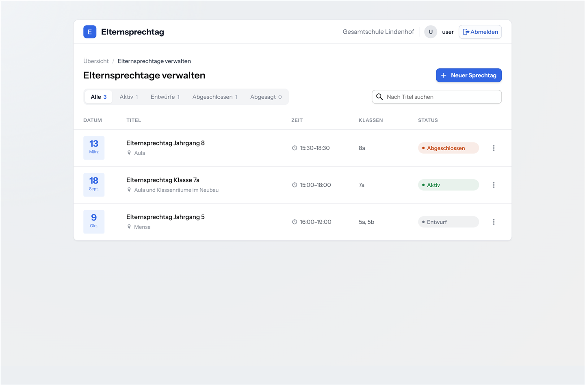
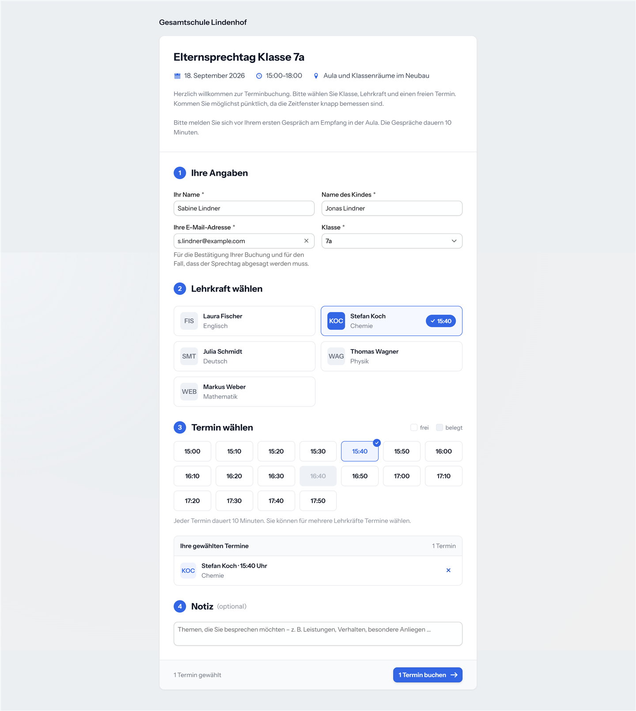
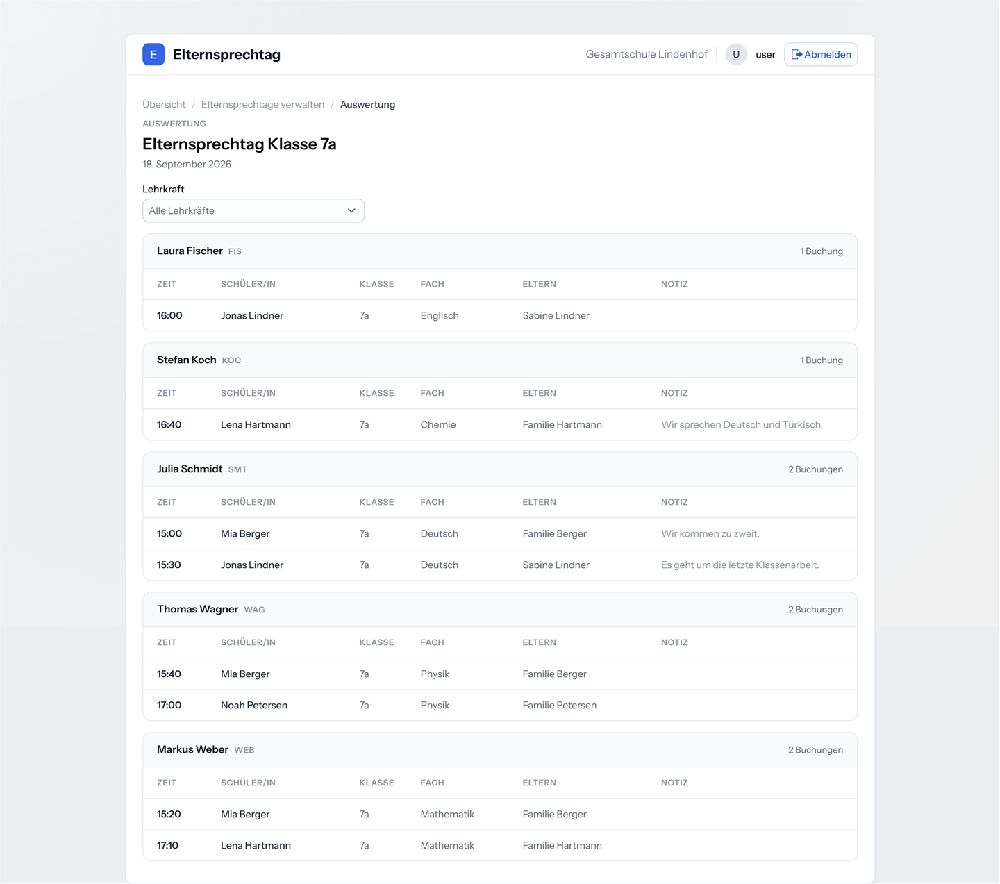

# Elternsprechtag

Terminbuchung für den Elternsprechtag einer Schule. Das Sekretariat legt den Sprechtag an,
veröffentlicht ihn und teilt einen Link; Eltern wählen darüber ohne Anmeldung ihre Gesprächstermine
bei den Lehrkräften ihres Kindes und bekommen eine Bestätigung per E-Mail. Am Sprechtag selbst hat
jede Lehrkraft ihren fertigen Terminplan — statt Listen auf Papier, Rückrufen und doppelt vergebenen
Zeiten.

> [!WARNING]
> **Version 0.x — noch nicht für den Echtbetrieb an einer Schule freigegeben.**
> Die Anwendung läuft und ist vollständig bedienbar, aber es fehlen Dinge, die ein produktiver
> Einsatz braucht:
> - **Stammdaten sind nur per SQL pflegbar.** Lehrkräfte, Klassen, Fächer und Lehraufträge werden
>   direkt in der Datenbank angelegt — es gibt weder Import noch Pflegemasken.
>
> Zum Ausprobieren, Bewerten und Mitentwickeln ist das Projekt gedacht — für den Sprechtag im
> nächsten Monat noch nicht.

## So sieht es aus

Die Ansicht des Organizers: alle Sprechtage mit Status, von der Vorbereitung bis zum Abschluss.



Die Buchungsansicht der Eltern — Klasse wählen, Lehrkraft wählen, freien Termin anklicken. Mehrere
Gespräche an einem Nachmittag sind eine einzige Buchung; belegte Zeiten sind gesperrt.



Die Auswertung: der Terminplan je Lehrkraft — die Liste, die am Sprechtag tatsächlich benutzt wird.



## Demo ausprobieren

Eine laufende Instanz mit erfundenen Stammdaten steht unter **<https://demo.openclassware.de>**.

| Zugang    | Benutzername | Passwort     |
|-----------|--------------|--------------|
| Organizer | `demo`       | `password`   |

Diese Zugangsdaten sind **absichtlich öffentlich**. Die Demo baut ihr Datenbankschema bei jedem
Start neu auf und wird zusätzlich täglich zurückgesetzt, sie verschickt keine echten E-Mails (der
Mailversand ist dort durch eine Log-Attrappe ersetzt), und alle Daten sind erfunden. Es gibt dort
nichts zu schützen — probieren Sie ruhig alles aus, auch das Absagen eines Sprechtags.

Die Elternansicht erreichen Sie, indem Sie als Organizer einen Sprechtag anlegen, ihn
veröffentlichen und den Zugangs-Link aufrufen, den die Anwendung Ihnen dabei anbietet. Eltern
brauchen kein Konto — der Link ist der gesamte Zugang.

**Was Sie dort eingeben, ist für alle sichtbar** und verschwindet spätestens beim nächsten
nächtlichen Reset. Bitte keine echten Namen oder Adressen.

## Betriebsmodell

**Jede Schule betreibt ihre eigene Instanz.** Es gibt keinen von uns betriebenen Dienst, keine
Mandantenfähigkeit und keine Registrierung: Sie installieren die Anwendung auf eigener
Infrastruktur, und die Daten bleiben dort. Datenschutzrechtlich verantwortlich ist damit die
betreibende Schule; das Projekt liefert ausschließlich Software und hat keinen Zugriff auf laufende
Instanzen.

Technisch ist es eine Spring-Boot-Anwendung mit Vaadin-Oberfläche und PostgreSQL-Datenbank,
konfiguriert über Umgebungsvariablen und als Docker-Image ausrollbar. Welche Anwendungsdaten dabei
entstehen — und damit, ob eine Datenschutzprüfung nötig ist — steht in
[Konfiguration & gespeicherte Daten](docs/konfiguration.md).

## Lokal starten

Voraussetzungen: **JDK 25** und **Docker** (für die Datenbank).

```bash
git clone https://github.com/openClassware/elternsprechtag.git
cd elternsprechtag
./mvnw spring-boot:run
```

Die Anwendung startet die PostgreSQL-Datenbank aus [`compose.yaml`](compose.yaml) selbst und ist
danach unter <http://localhost:8080> erreichbar. Ohne gesetzte Umgebungsvariablen gelten die
Entwicklungs-Defaults aus [`application.properties`](src/main/resources/application.properties),
inklusive eines für jeden nachlesbaren Organizer-Zugangs — für eine erreichbare Instanz müssen
Datenbankverbindung und Organizer-Zugang gesetzt werden (siehe
[Konfiguration](docs/konfiguration.md)).

Eine frische Datenbank ist leer. Mit dem `demo`-Profil kommen Beispiel-Stammdaten (Lehrkräfte,
Klassen, Fächer, Lehraufträge) dazu:

```bash
SPRING_PROFILES_ACTIVE=demo ./mvnw spring-boot:run
```

### Datenbankschema

Das Schema gehört [Flyway](https://flywaydb.org/): Die Skripte liegen unter
[`src/main/resources/db/migration`](src/main/resources/db/migration) und laufen beim Start in
jedem Profil, auch in Tests. Hibernate prüft das Ergebnis nur noch
(`spring.jpa.hibernate.ddl-auto=validate`) und ändert nichts mehr selbst — passen Entitäten und
Migrationen nicht zusammen, startet die Anwendung gar nicht erst.

Das `demo`-Profil nimmt zusätzlich [`db/demo`](src/main/resources/db/demo) in die Suchpfade auf;
dort liegen die Demo-Stammdaten als wiederholbare Migration. Eine Schulinstanz aktiviert dieses
Profil nicht und bekommt sie deshalb nie.

Jede Schemaänderung ist damit ein neues, versioniertes Skript (`V2__…sql`, `V3__…sql`); bereits
ausgelieferte Skripte werden nicht mehr geändert, Flyway prüft ihre Prüfsummen.

Wer die Entwicklungsdatenbank noch aus der Zeit vor Flyway hat, muss sie einmalig leeren — Flyway
verweigert die Arbeit an einem gefüllten Schema ohne Historientabelle:

```bash
docker exec elternsprechtag-database-1 psql -U myuser -d elternsprechtag \
  -c 'DROP SCHEMA public CASCADE' -c 'CREATE SCHEMA public'
```

Tests laufen mit:

```bash
docker compose up -d   # falls die Datenbank nicht ohnehin läuft
./mvnw verify
```

**Die Testsuite braucht eine laufende Datenbank.** Die Tests laufen bewusst gegen PostgreSQL und
nicht gegen eine untergeschobene In-Memory-Datenbank — nur so wird datenbankspezifisches Verhalten
in Tests überhaupt sichtbar.

Sie benutzen dabei eine **eigene Datenbank** (`elternsprechtag_test`), nicht die der Anwendung.
Das ist kein Detail: Die Service-Tests räumen vor jedem Test alle Tabellen ab. Liefen sie gegen
`elternsprechtag`, würde jedes `./mvnw verify` die Daten leeren, mit denen gerade entwickelt wird —
lautlos und auch bei laufender Anwendung. Angelegt wird sie von
[`docker/init-test-db.sql`](docker/init-test-db.sql) beim **ersten** Start des Containers. Wer den
Container schon länger laufen hat, legt sie einmalig von Hand an:

```bash
docker exec elternsprechtag-database-1 \
  psql -U myuser -d elternsprechtag -c 'CREATE DATABASE elternsprechtag_test'
```

Anders als beim Anwendungsstart fährt der Testlauf die Datenbank **nicht** selbst hoch: Spring
Boots Docker-Compose-Unterstützung hängt am Start der Anwendung, nicht am Start der Tests. In der
Praxis fällt das selten auf, weil der Container aus [`compose.yaml`](compose.yaml) mit
`restart: always` läuft, sobald er einmal gestartet wurde. Wer ihn gestoppt hat, bekommt rote
Tests mit Verbindungsfehler — dann hilft die Zeile oben.

Auch die Test-Datenbank füllt Flyway. Sie bleibt zwischen zwei Läufen bestehen, im CI ist sie bei
jedem Lauf frisch — wer sie noch aus der Zeit vor Flyway hat oder eine Migration lokal ändert,
während sie schon eingespielt war, bekommt hier rote Tests, die im CI grün sind. Dann hilft ein
Neuanlegen:

```bash
docker exec elternsprechtag-database-1 psql -U myuser -d elternsprechtag \
  -c 'DROP DATABASE elternsprechtag_test' -c 'CREATE DATABASE elternsprechtag_test'
```

## Dokumentation

| Dokument                                             | Inhalt                                                          |
|------------------------------------------------------|-----------------------------------------------------------------|
| [Konfiguration & gespeicherte Daten](docs/konfiguration.md) | Alle Umgebungsvariablen, Defaults, Profile und die Frage, welche Daten entstehen |
| [Deploy](docs/deploy.md)                              | Wie die öffentliche Demo betrieben wird                          |
| [CI](docs/ci.md)                                      | Was auf dem Weg nach `main` geprüft wird                         |
| [Domänen-Kontext](CONTEXT.md)                         | Das Vokabular des Projekts: Sprechtag, Termin, Buchung, Lehrauftrag |
| [Architektur](docs/arc/ARCHITECTURE.md)               | Schichtung, Auth-Modell, Entscheidungen                          |

## Lizenz

[Apache-2.0](LICENSE) — frei nutzbar, veränderbar und weitergebbar, auch kommerziell.
